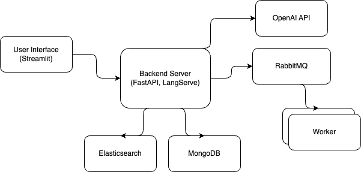
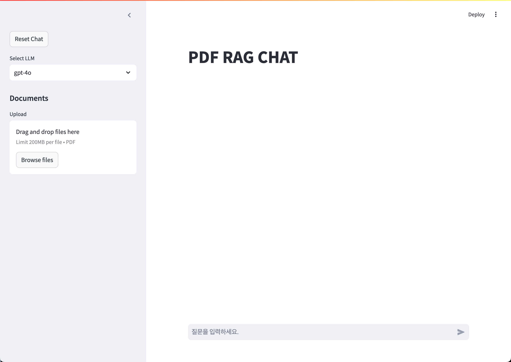
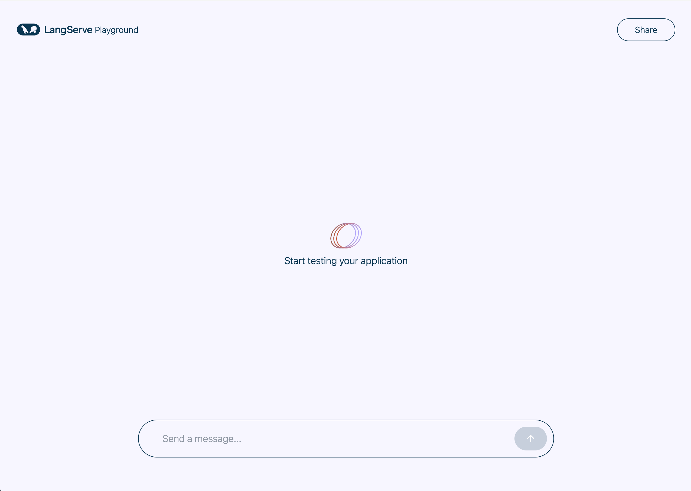
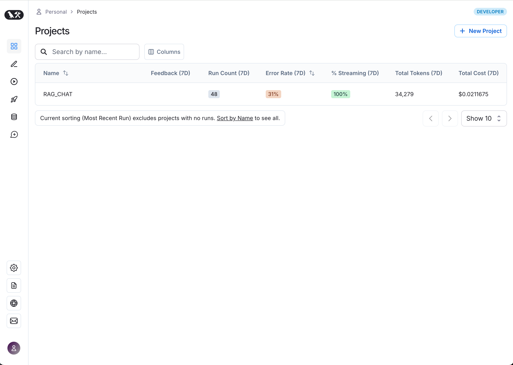

# PDF RAG Chat

This repository provides a system for building a chatbot that utilizes Retrieval-Augmented Generation (RAG) to answer questions based on PDF documents. The system integrates with Elasticsearch, MongoDB, and RabbitMQ, and uses OpenAI's language model to generate responses.

## Details

- **RAG Integration**: The system uses Retrieval-Augmented Generation (RAG) to ensure accurate and contextually relevant responses by retrieving and generating information based on the PDF content.
- **LLM Model**: The chatbot is powered by one of the GPT-based LLM models, enhancing its ability to understand and generate human-like responses.
- **AI Framework**: The system leverages LangChain and LangSmith frameworks to structure and manage interactions between components, providing a robust, scalable foundation for AI operations.
- **Scalable Document Ingestion**: RabbitMQ is used to handle the document ingestion process, allowing for easy scaling and managing large volumes of documents.
- **Stateless Server Architecture**: The backend server is designed to be stateless, ensuring that it can handle high levels of concurrent requests efficiently, making it ideal for production environments.

## Features

- **Streamlit Interface**: Provides a simple UI for interacting with the chatbot.
- **Chat Interface**: Interact with a chatbot that retrieves relevant information from PDF documents.
- **Elasticsearch Integration**: Efficiently stores and retrieves vectorized documents.
- **RabbitMQ**: Manages the task queue for document processing.
- **MongoDB**: Stores metadata and document details.

## Architecture

- The architecture of the system is depicted in the following diagram:
   

## Prerequisites

Ensure you have the following installed on your system:

- Docker and Docker Compose
- Python 3.11+

## Installation

1. **Clone the repository:**
    
    ```bash
    git clone https://github.com/seofield/pdf_rag_chat.git
    cd pdf_rag_chat
    ```
    
2. **Set up environment variables:**
    
    Copy the `.env_sample` to `.env` and update it with your specific configurations.
    
    ```bash
    cp .env_sample .env
    ```
    
3. **Build and start the services using Docker Compose:**
    
    ```bash
    docker compose build
    docker compose up -d
    ```
    
    This will set up all necessary services, including Elasticsearch, MongoDB, RabbitMQ, and the Streamlit interface.
    
4. **Create Elasticsearch Index:**
    
    After starting the services, run the following command to create the necessary Elasticsearch index:
    
    ```bash
    docker compose exec langserve python scripts/create_index.py
    ```
    
    This command will execute a Python script inside the `langserve` service container to create the required index in Elasticsearch.
    

## Usage

1. **Access the Chat Interface:**
    
    After the services start, the `Streamlit` interface will be available at `http://localhost:8501`.
    
2. **Upload a PDF:**
    
    Use the interface to upload a PDF document. The chatbot will then be able to answer questions based on the content of the uploaded document.
    
3. **Ask Questions:**
    
    Enter your questions into the chat interface. The chatbot retrieves relevant information from the PDF and generates a response. 

4. **Access via `langserve`:**

   You can also access the chatbot service through the `langserve` chat interface, available at `http://localhost:8000/rag-elasticsearch/playground/`. Please refer to the API documentation for details at `http://localhost:8000/docs`.

## Visuals

<p align="center">
    
    
    
</p>